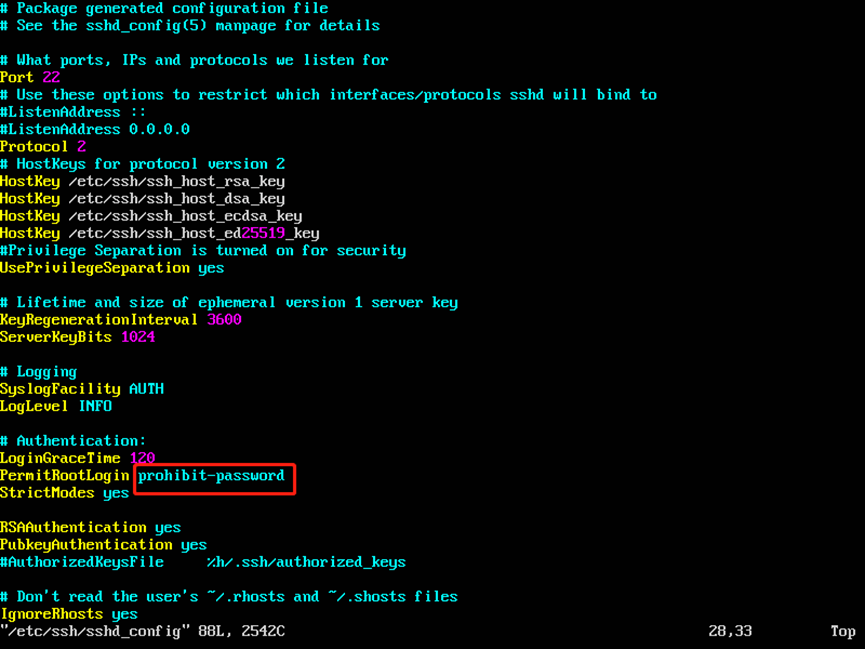
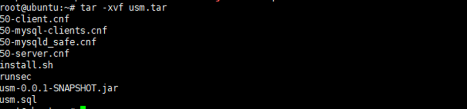

# 工业知识图谱服务部署记录

## 1.系统安装.

安装Ubuntu 16.04系统，[详细文档在这里](https://ubuntu.com/tutorials/install-ubuntu-server-1604#1-overview)。

## 2.系统配置.

1. 创建root用户并设置密码，用于后续ssh远程连接上传部署文件，具体操作命令如下:

   ```sh
   sudo passwd root
   ```

   之后为root用户输入两次密码即可

2. 配置系统网络，即通过`vim /ect/network/interfaces`修改网络配置，具体包括设置IP模式(DHCP、Static)，配置网关、DNS服务器、子网掩码等内容，具体配置信息如下：

   ```sh
   # This file describes the network interfaces available on your system
   # and how to activate them. For more information, see interfaces(5).
   
   source /etc/network/interfaces.d/*
   
   # The loopback network interface
   auto lo
   iface lo inet loopback
   
   auto enp1s0
   iface enp1s0 inet static
   address 192.168.99.240
   netmask 255.255.255.0
   gateway 192.168.99.1
   dns-nameservers 114.114.114.114
   dns-nameservers 8.8.8.8
   ```

   根据实际情况配置IP网址即可，配置完成后`service  networking restart`重启网络。

3. 通过`vim /etc/ssh/sshd_config`修改SSH配置文件，将PermitRootLogin项修改为yes，如下图：

   

   运行`service ssh restart`重启ssh服务

## 3. 部署知识图谱原型系统.

### 3.1 安装依赖服务

1. 将neo4j-community-4.4.20-unix.tar.gz、node-v17.9.1-linux-x64.tar.xz、Anaconda3-2023.03-0-Linux-x86_64.sh和jdk-11.0.22_linux-x64_bin.tar.gz依赖包上传至root目录下

2. 分别解压Neo4j、Node和Java的压缩包到当前目录，解压完成后`vim /etc/profile`配置如下环境变量到文件中:

   ```sh
   export JAVA_HOME=/root/jdk-11.0.22
   export PATH=$PATH:$JAVA_HOME/bin:/root/neo4j-community-4.4.20/bin:/root/anaconda3/bin:/root/node-v17.9.1-linux-x64/bin
   ```

### 3.2 安装Neo4j 并将工业流程安全知识图谱导入

1. 上传知识图谱导出数据包`kgtest.db.dump`

2. 将导出数据导入到neo4j的kgtest数据库中:

   ```sh
   neo4j-admin load --from=/root/neo4j_graph.db.dump --database=kgtest --force
   ```

3. 给改`/root/neo4j-community-4.4.20/conf/neo4j.conf`配置为如下内容，或者直接进行替换:

   ```SH
   #*****************************************************************
   # Neo4j configuration
   #
   # For more details and a complete list of settings, please see
   # https://neo4j.com/docs/operations-manual/current/reference/configuration-settings/
   #*****************************************************************
   
   # The name of the default database
   dbms.default_database=kgtest
   
   
   dbms.directories.import=import
   
   # Whether requests to Neo4j are authenticated.
   # To disable authentication, uncomment this line
   dbms.security.auth_enabled=false
   
   
   dbms.tx_state.memory_allocation=ON_HEAP
   
   
   dbms.default_listen_address=0.0.0.0
   
   
   dbms.default_advertised_address=10.245.142.112
   
   # Bolt connector
   dbms.connector.bolt.enabled=true
   #dbms.connector.bolt.tls_level=DISABLED
   dbms.connector.bolt.listen_address=0.0.0.0:10132
   dbms.connector.bolt.advertised_address=0.0.0.0:10132
   
   # HTTP Connector. There can be zero or one HTTP connectors.
   dbms.connector.http.enabled=true
   dbms.connector.http.listen_address=0.0.0.0:10133
   dbms.connector.http.advertised_address=0.0.0.0:10133
   
   # HTTPS Connector. There can be zero or one HTTPS connectors.
   dbms.connector.https.enabled=false
   #dbms.connector.https.listen_address=:7473
   
   
   # Retention policy for transaction logs needed to perform recovery and backups.
   dbms.tx_log.rotation.retention_policy=1 days
   
   #dbms.security.procedures.allowlist=apoc.coll.*,apoc.load.*,gds.*
   apoc.import.file.enabled=true
   dbms.security.procedures.unrestricted=apoc.*
   #********************************************************************
   # G1GC generally strikes a good balance between throughput and tail
   # latency, without too much tuning.
   dbms.jvm.additional=-XX:+UseG1GC
   
   # Have common exceptions keep producing stack traces, so they can be
   # debugged regardless of how often logs are rotated.
   dbms.jvm.additional=-XX:-OmitStackTraceInFastThrow
   
   # Try reducing the heap memory, if this flag degrades performance.
   dbms.jvm.additional=-XX:+AlwaysPreTouch
   
   # serialization to change the value of final fields!
   dbms.jvm.additional=-XX:+UnlockExperimentalVMOptions
   dbms.jvm.additional=-XX:+TrustFinalNonStaticFields
   
   # Disable explicit garbage collection, which is occasionally invoked by the JDK itself.
   dbms.jvm.additional=-XX:+DisableExplicitGC
   
   #Increase maximum number of nested calls that can be inlined from 9 (default) to 15
   dbms.jvm.additional=-XX:MaxInlineLevel=15
   
   # Disable biased locking
   dbms.jvm.additional=-XX:-UseBiasedLocking
   
   # Restrict size of cached JDK buffers to 256 KB
   dbms.jvm.additional=-Djdk.nio.maxCachedBufferSize=262144
   
   # More efficient buffer allocation in Netty by allowing direct no cleaner buffers.
   dbms.jvm.additional=-Dio.netty.tryReflectionSetAccessible=true
   
   # This is to protect the server from any potential passive eavesdropping.
   dbms.jvm.additional=-Djdk.tls.ephemeralDHKeySize=2048
   
   # This mitigates a DDoS vector.
   dbms.jvm.additional=-Djdk.tls.rejectClientInitiatedRenegotiation=true
   
   # Increase the default flight recorder stack sampling depth from 64 to 256, to avoid truncating frames when profiling.
   dbms.jvm.additional=-XX:FlightRecorderOptions=stackdepth=256
   
   # Allow profilers to sample between safepoints. Without this, sampling profilers may produce less accurate results.
   dbms.jvm.additional=-XX:+UnlockDiagnosticVMOptions
   dbms.jvm.additional=-XX:+DebugNonSafepoints
   
   # Disable logging JMX endpoint.
   dbms.jvm.additional=-Dlog4j2.disable.jmx=true
   
   # Name of the service
   dbms.windows_service_name=neo4j
   
   #********************************************************************
   # Other Neo4j system properties
   #********************************************************************
   apoc.export.file.enabled=true
   
   ```

4. `neo4j start`重新启动并测试10133端口是否能够访问neo4j服务。

### 3.3 安装后端并设置开机自动启动

1. 安装后端项目运行所必须的依赖包:

   ```python
   python -m pip install -r requirements.txt
   ```

2. `vim /etc/init.d/kg_backend`编辑开机自启动脚本:

   ```sh
   #!/bin/bash
   ### BEGIN INIT INFO
   # Short-Description:    kg_backend
   # Description:          kg_backend
   # Provides:             kg_backend
   # Required-Start:      $all 
   # Required-Stop:       $all
   # Default-Start:       1 2 3 4 5 6
   # Default-Stop:        0 1 
   ### END INIT INFO
   # 使用conda环境中的Python解释器路径直接启动Python脚本
   nohup /root/anaconda3/bin/python /root/project/backend/run.py >/root/project/backend/kg_backend.log 2>&1 &
   ```

   **注**:ubuntu 16.04中一定要加上以下LSB信息，不然放入启动脚本的时候会报错无法开机启动。

   ```sh
   #!/bin/sh
   ### BEGIN INIT INFO
   # Provides:          start-zookeeper.sh
   # Required-start:    $local_fs $remote_fs $network $syslog
   # Required-Stop:     $local_fs $remote_fs $network $syslog
   # Default-Start:     2 3 4 5
   # Default-Stop:      0 1 6
   # Short-Description: starts the start-zookeeper.sh daemon
   # Description:       starts start-zookeeper.sh using start-stop-daemon
   ### END INIT INFO
   ```

3. 为新创建的启动脚本设置执行权限:

   ```sh
   chmod +x /etc/init.d/kg_backend
   ```

4. 创建启动符号链接，可以手动创建也可以自动创建，自动创建命令如下:

   ```sh
   sudo update-rc.d kg_backend defaults
   ```

### 3. 4 安装前端Vue项目并配置Nginx

1. 上传前端项目包knowledge_graph_visualization.tar.gz，并解压到`root/project`目录下。

2. 运行`chmod -R 755 node_modules `修改`node_modules`目录文件的权限，允许执行。

3. `vim /src/api/cypher.js`修改cypher查询请求api中的url基本地址。

4. 运行`npm run serve`测试前端是否能正常启动并且能够接收到相关请求数据。

5. 测试无误后运行`npm run build`生成Nginx部署文件`./dist`

6. 将`./dist`复制到`/var/www/kg_visualization`下，因为出于安全考虑**Nginx被设置为www-data用户启动的服务**，无法运行位于root目录下的内容。

   ```sh
   sudo cp -r /root/project/kg_visualization/knowledge_graph_visualization/kg_visualization /var/www/kg_visualization
   ```

7. 为www-data用户设置这些文件的权限:

   ```sh
   sudo chown -R www-data:www-data /var/www/kg_visualization
   sudo find /var/www/kg_visualization -type d -exec chmod 755 {} \;
   sudo find /var/www/kg_visualization -type f -exec chmod 644 {} \;
   
   ```

8. 安装Nginx之后，`vim /etc/nginx/sites-available/kg_visualization `存放vue项目的应用配置，配置内容如下：

   ```sh
   server {
       listen 8080;
       server_name 192.168.99.240;
   
       location / {
           root /var/www/kg_visualization/dist; # Vue项目的部署路径
           try_files $uri $uri/ /index.html; # 用于支持基于HTML5 History API的路由
   	}
   }
   
   ```

9. 为项目配置创建一个符号链接到`/etc/nginx/sites-enabled/`目录，这样Nginx会在启动时加载这个配置：

   ```sh
   sudo ln -s /etc/nginx/sites-available/kg_visualization /etc/nginx/sites-enabled/
   ```

   **注意**：某些Nginx安装默认不包括`/etc/nginx/sites-enabled/`目录。如果这个目录不存在，需要手动创建它，并确保的`nginx.conf`文件中包含了这一行：

   ```
   include /etc/nginx/sites-enabled/*;
   ```

10. 检查Nginx语法正确后重启Nginx服务:

    ```sh
    sudo nginx -t
    sudo systemctl restart nginx
    ```

    

## 4. 部署防火墙统一管理平台.

1. 上传usm.tar资源文件，并`tar -xvf usm.tar`解压到当前目录。

   

2. 安装mariadb-server、python、redis-server、default-jdk和ntp等依赖包:

   ```shell
   apt-get install mariadb-server python redis-server default-jdk ntp -y
   ```

3. 移动相关配置文件:

   ```sh
   rm /etc/mysql/mariadb.conf.d/*
   mv /root/*.cnf /etc/mysql/mariadb.conf.d/
   ```

4. 配置MySQL数据库:

   ```mysql
   mysql –u root –p 输入两次enter
   
   use mysql
   GRANT ALL PRIVILEGES ON *.* TO 'root'@'%' IDENTIFIED BY 'hitimc@secfw' WITH GRANT OPTION;
   delete from user where Host='localhost';
   create database usm;
   use usm;
   source /opt/usm.sql
   flush privileges;
   quit
   service mysql restart
   ```

5. 重启检查服务是否启动成功