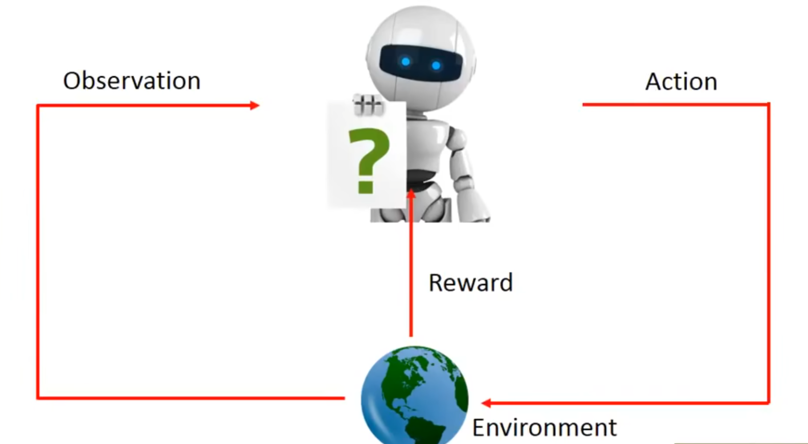
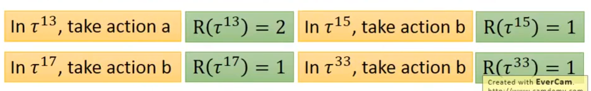
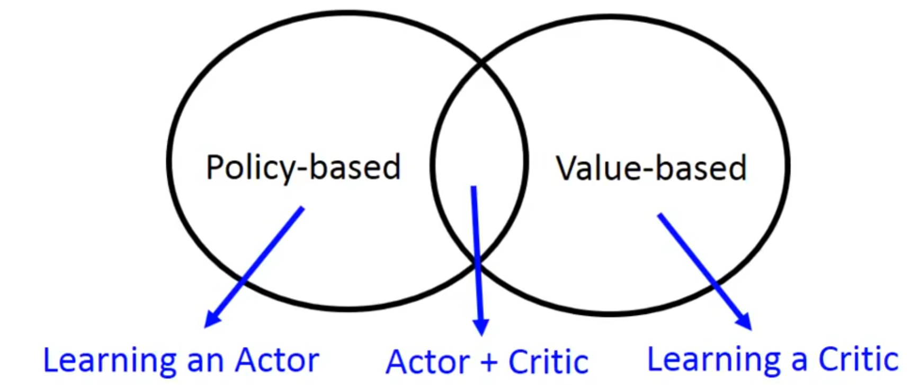

## 总体结构 

state：并不是单指actor的状态，而是环境中actor的状态

action:

observation：

environment：

episode：开始到整个结束的学习过程，包括所有的状态和动作以及得分，例如$\tau = \{s_1, a_1, r_1, s_2, a_2,  r_2 ... , s_t,a_t,r_t\}$(没有observation哦)

环境变化可能与action有关也可能无关

> 难点
>
> - 奖励延迟
> - agent探索

## 训练过程

### 1.Actor行动选择器

以图像游戏为例，采用神经网络。

### 2.选择器好坏的衡量

$$
\bar{R_{\theta}} = \sum_{\tau}{R(\tau) \ P(\tau|\theta)} \approx \frac{1}{N} \sum_{n=1}^N{R(\tau^n)} \\

P(\tau| \theta) = p(s_1)p(a_1|s_1, \theta)p(r_1, s_2 | a_1 , s_1)p(a_2|s_2, \theta)p(s_3,r_2 | a_2, s_2)... \\
=p(s_1)\prod_{t=2}^{T_n}P(a_{t-1} | s_{t-1}, \theta)P(s_t, r_{t-1} | a_{t-1}, s_{t-1})
$$

其中$R(\tau)$表示某种episode的Reward，$P(\tau|\theta)$表示这种episode在参数$\theta$下的期望，$\theta$为学习的参数，其核心思想是用每种可能序列的期望来衡量选择器的好坏。计算期望时采用**蒙特卡洛采样法(大数定律)**取$N$次并算平均作为期望。

### 3.选择最好的选择器

将$\bar{R_\theta}$视为优化目标，通过反向传播优化参数$\theta$，其具体数学原理如下：

- 假设目标最优参数为$\theta^* = arg \ \mathop{max}\limits_\theta \bar{R_\theta}$ ，其中$\bar{R_{\theta}} = \sum_{\tau}{R(\tau) \ P(\tau|\theta)}$。

- 梯度下降优化过程如下：

  - 模型训练初始化参数$\theta^0$

  - 逐轮优化$\theta^n \leftarrow \theta^{n-1} + \eta \nabla \bar{R_{\theta_{n-1}}} $

  - $\nabla \bar{R_{\theta}}$的计算过程如下，$R(\tau)$由环境决定，不包含相关参数，所以计算相关内容时只需要计算$P(\tau|\theta)$的偏导即可 ：
    $$
    \nabla \bar{R_{\theta}}= \sum_{\tau}R(\tau) \nabla P(\tau | \theta) \\ =\sum_{\tau}R(\tau)P(\tau| \theta) \frac{\nabla P(\tau|\theta)}{P(\tau|\theta)}  \\
    =\sum R(\tau)P(\tau|\theta) \ \nabla log(P(\tau| \theta)) \\
    \approx \frac{1}{N} \sum_{n=1}^NR(\tau^n) \ \nabla log(P(\tau|\theta))
    $$
    表达式通过变形出现了$\sum P(\tau|\theta)$的形式，之后就可以蒙特卡洛方法（大数定律），即每次使用agent在$\theta$下运行$N$次，获得$\{\tau^1, \tau^2, ..., \tau^N\}$，之后对每次episode($\tau$)的Reward根据上述式子计算偏导后求平均即为梯度。

  - 计算$\nabla log(P(\tau|\theta))$:
    $$
    log(P(\tau|\theta))=log(p(s_1)) + \sum_{t=2}^{T_n}\ log(P(a_{t-1} | s_{t-1}, \theta)) + log(P(s_t, r_{t-1} | a_{t-1}, s_{t-1})) \\
    =\sum_{t=2}^{T_n} \nabla log(P(a_{t-1} | s_{t-1},\theta))
    $$

  - 所以最终的梯度计算公式如下：
    $$
    \nabla \bar{R_{\theta}}\approx \frac{1}{N} \sum_{n=1}^NR(\tau^n) \ \nabla log(P(\tau^n|\theta)) \\
    =\frac{1}{N}\sum_{n=1}^N R(\tau^n)\sum_{t=2}^{T_n} \nabla log(P(\tau^n_t| \theta)) \\
    = \frac{1}{N}\sum_{n=1}^N \sum_{t=2}^{T_n} R(\tau^n) \nabla log(P(a_{t-1}^n | s_{t-1}^n, \theta))
    $$
    直观来看，在计算某个具体的行动的梯度时，使用这个序列整体的Reward乘以当时状态和参数条件下取该行动的对数概率值的梯度。

    - 要注意在计算时需要用整体的Reward，这很大程度上是因为RL的延迟满足性质决定的，因为很多任务只有在最后一步再有Reward，如果用具体每一个行动的Reward来计算梯度的话，很多动作将被判定为无用(奖励为0)，agent将无法行动。

    - 为什么要取概率的对数呢？除了方便蒙特卡洛采样外， 这样可以避免概率大但是Reward小的行动在采样过程中出现次数多导致的错误训练方向。

      

      比如上面的情况，a只出现了一次出现的概率为$1/4$，它的Reward显然比b高，但是由于只在整个采样过程中出现一次，所以如果不采用log值计算更新参数后在出现相同的情况下更倾向与选择b。因为$\nabla log(P(a_n^{t-1}|s^{t-1}_n, \theta)) = \frac{\nabla P(a^{t-1}_n|s^{t-1}_n, \theta)}{P(a^{t-1}_n|s^{t-1}_n, \theta)}$,所以就相当于除去了对应概率的影响。

反向传播

## 训练方法

 

### Policy-based

### Value-based

### A3C

