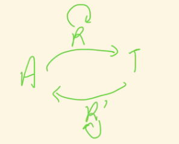

# cyclegan improved methods inspirate kgc

## U-GAT-IT（cyclegan + attention）

原论文对cyclegan中的**环路**改进是通过在生成器中从不同维度提取数据的**feature map**，之后通过一个**classifier（全连接层$\eta_s$）**判断这些**features map**属于当前域的概率，之后用全连接层的权重乘以当前的**feature map**作为最终的**attention**。对于$\eta_s$它应当能够区分是真实数据的特征还是生成数据的特征，从而来训练模型。

按照同样的思路来改进**kgc（知识图谱补全）**过程，众所周知补全的过程就是头尾实体的互相推断的环路，如下图：

区别在于使用了表示学习推理，$h+r$去直接预测$t$，以特征表示的相似性来判别预测的准确性，受上述论文的启发，可以在中的环路中加入**classifier$\eta_s$**判断$h + r$的特征那些更符合$t$，因为原文中对应的对抗过程，所以 $\eta_x$被设计为严格区分$h+r$和$t$的鉴别器，我们没有为模型再引入额外的鉴别器，而是通过$\eta_s$判别双方相似的特征，从而扩大该特征的影响力。目前具体做法思路如下：

- $h+r$和$t$在经过**BERT**提取特征$f^k_s$，之前的做法是简单经过**pool**或者直接取**cls**进行后续的操作，现在想要通过$\eta_s$判断不同特征是$t$中关键特征的概率$p^k_s$(如何衡量)
- 判断后按照$f^k_s * W^k_s * p^k_s$的公式进行加权得到推断的尾实体$t$的表示。
- 从后往前推亦是如此

