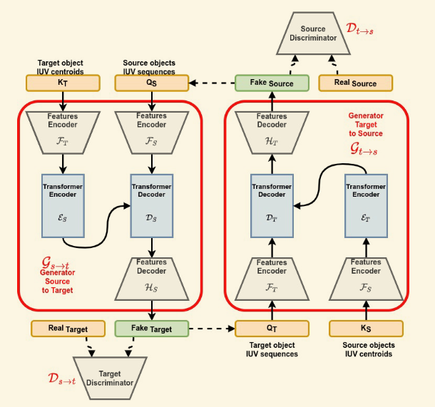
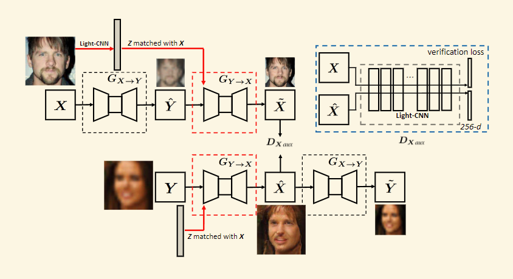
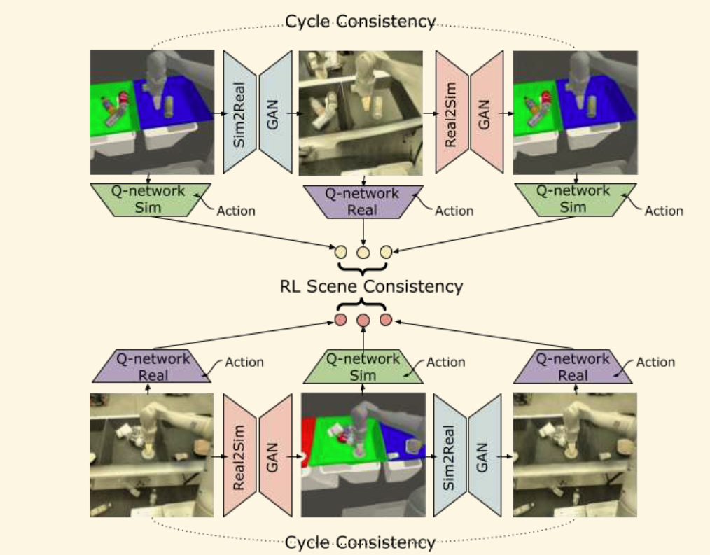
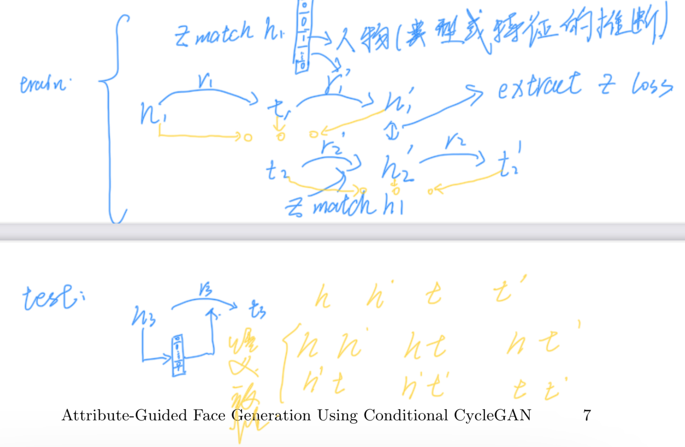

# cyclegan improved methods inspirate kgc

## 1.U-GAT-IT（cyclegan + attention）

原论文对cyclegan中的**环路**改进是通过在生成器中从不同维度提取数据的**feature map**，之后通过一个**classifier（全连接层$\eta_s$）**判断这些**features map**属于当前域的概率，之后用全连接层的权重乘以当前的**feature map**作为最终的**attention**。对于$\eta_s$它应当能够区分是真实数据的特征还是生成数据的特征，从而来训练模型。

按照同样的思路来改进**kgc（知识图谱补全）**过程，众所周知补全的过程就是头尾实体的互相推断的环路，如下图：

区别在于使用了表示学习推理，$h+r$去直接预测$t$，以特征表示的相似性来判别预测的准确性，受上述论文的启发，可以在中的环路中加入**classifier$\eta_s$**判断$h + r$的特征那些更符合$t$，因为原文中对应的对抗过程，所以 $\eta_x$被设计为严格区分$h+r$和$t$的鉴别器，我们没有为模型再引入额外的鉴别器，而是通过$\eta_s$判别双方相似的特征/或者直接引入$h+r$和$t$的注意力机制，从而扩大该特征的影响力。目前具体做法思路如下：

- $h+r$和$t$在经过**BERT**提取特征$f^k_s$，之前的做法是简单经过**pool**或者直接取**cls**进行后续的操作，现在想要通过$\eta_s$判断不同特征是$t$中关键特征的概率$p^k_s$(如何衡量) / 或者直接计算这些特征之间的注意力机制
- 判断后按照$f^k_s * W^k_s * p^k_s$的公式进行加权得到推断的尾实体$t$的表示。
- 从后往前推亦是如此。

## 2. cycle consistent + perceptual loss

**[Cycle Dehaze](https://ar5iv.labs.arxiv.org/html/1805.05308)**的任务背景是雾化图像的去雾图片生成，文章在原先cyclegan损失的基础上增加了一项`perceptual-consistency`损失：
$$
\begin{aligned}
\mathcal{L}_{Perceptual}& =\|\phi(x)-\phi(F(G(x)))\|_{2}^{2}  \\
&+\|\phi(y)-\phi(G(F(y)))\|_{2}^{2}.
\end{aligned}
$$
其中$\phi(x)$表示从VGG16模型(**CNN**)的第二和第五池化层提取的特征，**其本质上就是数据提取特征的循环一致性损失**，可以将上述损失思路加到kgc的训练链路中:

- $\phi(x)$表示从**BERT**中提取的$h$特征
- $\phi(y)$表示从**BERT**中提取的$t$特征
- $F(G(x))$表示**BERT**中提取的$t + r'$特征
- $G(F(x))$表示**BERT**中提取的$h + r$特征

从不同的维度去学习三元组中的信息，但是有什么道理，还不太明白

## 3. cyclegan + transformer

[CTrGAN（2023 WACV）](https://openaccess.thecvf.com/content/WACV2023/papers/Mahpod_CTrGAN_Cycle_Transformers_GAN_for_Gait_Transfer_WACV_2023_paper.pdf) ，其任务是人物步态视频目标替换，将视频中行走的人物用新的目标进行替换。将**Transformer**集成到生成器中，在$\mathcal{G}_{s \to t}$生成器中将目标数据的**Key(使用VGG16提取)**向量输入到Transformer的Encoder中，同时将源数据的**Query**向量输入到Transformer的Decoder中，用Decoder输出数据进行Fake数据的生成。

 在后续应用过程中可以直接将源域和目标域数据替换成对应的$h \ r \ t$三元组。

## 4 Conditional Cyclegan

[Attribute-Guided Face Generation Using Conditional CycleGAN（ECCV 2018）](https://openaccess.thecvf.com/content_ECCV_2018/papers/Yongyi_Lu_Attribute-Guided_Face_Generation_ECCV_2018_paper.pdf)研究使用**条件循环生成对抗网络（Conditional Cyclegan）**，在人脸生成任务中引入了属性指导的概念。

文章提出使用**属性向量$z$**用来表示对应人脸的不同属性，如肤色、发型和瞳色等，特征使用Light-CNN或其他特征提取器产生，模型具体结构如下：

模型中的关键点在于为生成器$\mathcal{G}_{Y \to X}$(模糊到清晰)引入了专门度量重构数据$\tilde{X}$和生成数据$\hat{X}$特征差异的**特征验证损失**，从而发挥$z_x$的指导作用。

可以借鉴该模型思路，在$t \to h$过程引入$h +r$的特征向量。

模型的损失与传统Cyclegan模型类似包含以下几个部分：

- 对抗生成损失：

$$
\begin{aligned}\mathcal{L}(G_{(X,Z)\to Y},D_Y)&=\min_{\Theta_g}\max_{\Theta_d}\big\{\mathbb{E}_{y,z}[\log D_Y(y,z)]\\&+\mathbb{E}_{x,z}[\log(1-D_Y(G_{(X,Z)\to Y}(x,z),z))\big\}\end{aligned}
$$

- 生成器损失：
  $$
  \rho_{f}\leftarrow D_{Y}(\hat{y}) \\
  
  s_f\leftarrow D_X(\hat{y},z) \\
  
  \mathcal{L}_{G_{X\rightarrow Y}}\leftarrow\operatorname{log}(\rho_{f})+\mathcal{L}_{c} \\
  
  \mathcal{L}_{G_{Y\rightarrow X}}\leftarrow\operatorname{log}(s_{f})+\mathcal{L}_{c}
  $$
  
- 循环一致性损失：
  $$
  \mathcal{L}_c=\lambda_1\|\tilde{x}-x\|_1+\lambda_2\|\tilde{y}-y\|_1 \\
  \begin{aligned}
  &\hat{y} = G_{X\rightarrow Y}(x)\\
  &\tilde{x} = G_{Y\rightarrow X}(\hat{y},z) \\
  &\hat{x} = G_{Y\rightarrow X}(y,z) \\
  &\tilde{y} = G_{X\rightarrow Y}(\hat{x})
  \end{aligned}
  $$
  
- 特征验证损失：

$$
\mathcal{L}_v = \phi(D_{aux}(x) - D_{aux}(\hat{x}))
$$

## 5.cyclegan+ rl

[RL-CycleGAN: Reinforcement Learning Aware Simulation-To-Real(2020 CVPR)](https://openaccess.thecvf.com/content_CVPR_2020/html/Rao_RL-CycleGAN_Reinforcement_Learning_Aware_Simulation-to-Real_CVPR_2020_paper.html)，利用RL和Cyclegan结合来解决模拟到现实(sim-to-real)转移的问题。其核心思想是通过Cyclegan学习模拟世界到现实世界的相互映射，在学习过程中使用**强化学习方法规范对应转化过程中场景的一致性**（主要体现为不能丢失物体）。

模型的结构如上图所示，模型整体采用Cyclegan的架构，生成器负责实现不同数据的域转换，此外还在数据之间引入了虚拟/现实的**强化学习Q神经网络**，所有的虚拟图片使用$Q-network \ Sim$计算$Q-values$，同理所有的现实图片使用$Q-network \ Real$计算相应的值。此后使用计算出的6个$Q$值计算$RL-scene$损失，用于确保生成过程中场景的一致性(包括背景、物体等信息)。

具体而言，在这个强化的Cyclegan模型训练过程中，$x,y$会产生六张图像$\{x, G(x),F(G(x))\} , \{y, F(y), G(F(y))\}$都会被输入到相应的$Q_{sim}$或者$Q_{real}$网络中得到6个对应的$Q-value$值。对应两个三元组分别代表各自的场景，所以通过$RL-scene$一致性损失来确保生成对应相似的值。
$$
\begin{gathered}
(x,a)\sim\mathcal{D}_{sim},(y,a)\sim\mathcal{D}_{real} \\
q_{x}=Q_{sim}(x,a) \\
q_{x}^{\prime}=Q_{real}(G(x),a) \\
q_{x}^{\prime\prime}=Q_{sim}(F(G(x)),a) \\
q_{y}=Q_{real}(y,a) \\
q_{y}^{\prime}=Q_{sim}(F(y),a) \\
q_{y}^{\prime\prime}=Q_{real}(G(F(y)),a) 
\end{gathered}
$$

> 模型中Q-network对应的action是如何获取的呢

模型的损失包括如下几个方面：

- Temporal difference loss：强化学习中的优化目标，用于**衡量当前动作的影响**,其中$V(s')$表示当前的状态采取动作后的下一状态的value值，$Q(s,a)$则表示当前状态和动作的value。
  $$
  d(Q(s,a),r+\gamma V(s'))
  $$
  
- RL scene loss: 场景一致性损失，**评估模拟环境与真实环境之间在视觉场景呈现方面的差异**，并试图最小化这些差异。这种损失可能侧重于确保模拟生成的场景在视觉上与真实世界场景尽可能相似，从而让在模拟环境中训练的RL智能体能够更好地泛化到真实世界环境。
  $$
  \begin{aligned}\mathcal{L}_{RL-scene}(G,F)&=d(q_x,q_x')+d(q_x,q_x'')+d(q_x',q_x'')\\&+d(q_y,q_y')+d(q_y,q_y'')+d(q_y',q_y'')\end{aligned}
  $$
  其中$d$是距离计算方法，这里采用$MSE$，这个损失惩罚对应数据的$Q$值变化，鼓励在转化过程中保留相应的场景。

- RL loss：强化学习损失：
  $$
  \mathcal{L}_{RL}(Q)=\mathbb{E}_{(x,a,r,x^\prime)}d(Q(x,a),r+\gamma V(x^\prime))
  $$

  > 训练过程中的优化目标是什么，以及是如何将RL和Cyclegan结合的呢？

- 整体优化目标：
  $$
  \begin{aligned}
  &\mathcal{L}_{RL-CycleGAN}(G,F,D_{X},D_{Y},Q) \\
  &=\lambda_{GAN}\mathcal{L}_{GAN}(G,D_{Y}) \\
  &+\lambda_{GAN}\mathcal{L}_{GAN}(F,D_{X})+\lambda_{cycle}\mathcal{L}_{cyc}(G,F) \\
  &+\lambda_{RL-scence}\mathcal{L}_{RL-scene}(G,F)+\lambda_{RL}\mathcal{L}_{RL}(Q)
  \end{aligned}
  $$
  

在kgc任务过程中，会产生如下的实体$h,h',t,t'$，目前在进行推理时通过计算$\{ h+r\ (t'),t \}$和$\{t + \hat{r}\ (h'), h\}$的相似度来获取推理的效果。是否可以借鉴本论文的方法，增加本体语义一致性损失,即：
$$
\begin{aligned}\mathcal{L}_{sem}(h,h',t,t')&=d(h,h')+d(h,t)+d(h,t')+d(h',t)+d(h', t')+d(t,t')\end{aligned}
$$
想象中的模型架构如下:

