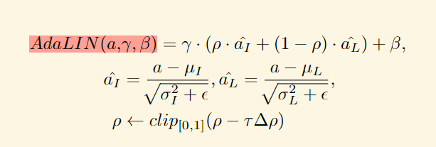

# The Methods that improve cyclegan 

## 1 Cyclegan +  Attention

为了解决`Cyclegan`在域迁移任务中`区域识别`能力不足的问题，**[U-GAT-IT](https://arxiv.org/pdf/1907.10830.pdf)**引入了新的注意力机制和可学习的归一化函数（AdaLIN），使得模型能够更加有效地处理图像间的几何变换和纹理变换，缓解了cyclegan存在的**对齐问题**。

### 1.1 模型架构

该模型架构如上图所示，总体上采用单**Gan**结构，包括生成器和鉴别器。在生成器和鉴别器中又采用了**VAE**结构，由**Encoder**和**Decoder**组成，同时在每个**Encoder**内部还有一个**Classifier**用于计算**Attention**的权重。

#### 1.1.1 生成器

生成器首先通过**Encoder**（$E_s$）提取数据的$n$个特征映射，图中$E^k_s$表述数据的第$k$个特征映射；此外$\eta_s(x)$表示对应特征属于$x$的概率，$\eta(x)$受***CAM***的启发，辅助分类器学习第$k$个特征映射的权重$w^k_s$。在得到$E^k_s$和$w^k_s$后通过$a_s(x)=w_s * E_s(x)=\{w^k_s * E^k_s(x)\}$来计算对应的**attention matrix**。

之后通过***AdaLIN***方法计算$\gamma$和$\beta$参数:

巴拉巴拉

#### 1.1.2 鉴别器

鉴别器的整体架构与生成器类似，都是采用**Encoder**和**Decoder**，此判别器与其他论文不同的点在于加入了$n_{D_t}(x)$判断 对应特征是来自原有数据还是生成数据，**attention matrix**$a_{D_t}(x)=w_{D_t} * E_{D_t}(x)$生成器计算方法类似。

### 1.2 损失函数

损失函数主要包含以下四个方面：

- 对抗性损失

  $$L_{lsgan}^{s\to t}=(\mathbb{E}_{x\sim X_t}[(D_t(x))^2]+\mathbb{E}_{x\sim X_s}[(1-D_t(G_{s\to t}(x)))^2]).$$

- 循环一致性损失

  $$L_{cycle}^{s\to t}=\mathbb{E}_{x\sim X_s}[|x-G_{t\to s}(G_{s\to t}(x)))|_1].$$

- 判别性损失

  $$L_{identity}^{s\to t}=\mathbb{E}_{x\sim X_t}[|x-G_{s\to t}(x)|_1].$$

- CAM损失

  $$\begin{gathered}L_{cam}^{s\to t}=-(\mathbb{E}_{x\sim X_s}[log(\eta_s(x))]+\mathbb{E}_{x\sim X_t}[log(1-\eta_s(x))]),\\\\L_{cam}^{D_t}=\mathbb{E}_{x\sim X_t}[(\eta_{D_t}(x))^2]+\mathbb{E}_{x\sim X_s}[(1-\eta_{D_t}(G_{s\to t}(x))^2].\end{gathered}$$

### 1.3 实验结果

