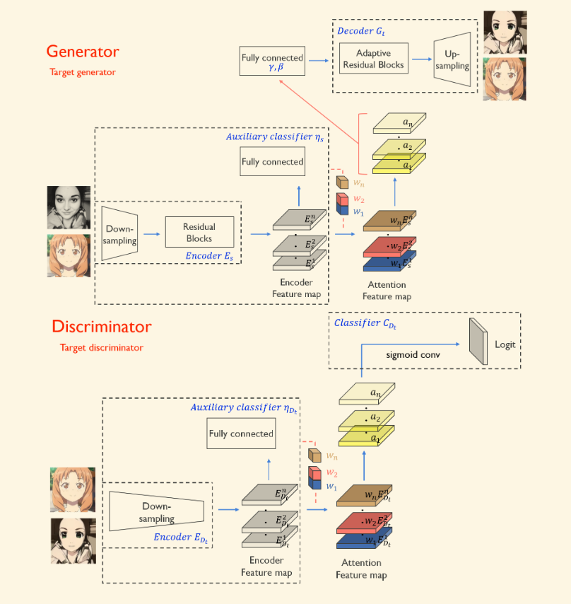

# The Methods that improve cyclegan 

## 问题回顾

## 1 Cyclegan +  Attention

为了解决`Cyclegan`在域迁移任务中`区域识别`能力不足的问题，**[U-GAT-IT（ICLR：2020）](https://arxiv.org/pdf/1907.10830.pdf)**引入了新的**注意力机制**和**可学习的归一化函数（AdaLIN）**，使得模型能够更加有效地处理图像间的几何变换和纹理变换，缓解了cyclegan存在的**对齐问题**。

### 1.1 模型架构

该模型架构如上图所示，总体上采用**CycleGan**结构(模型图中只展开了对称的半部分)，包括生成器和鉴别器。在生成器和鉴别器中又采用了类似**VAE**结构，由**Encoder**和**Decoder**组成，同时在每个**Encoder**内部还有一个**Classifier**用于计算**Attention**的权重，与传统**VAE**结构不同的是，在特征提取和数据还原的过程中，模型采用了**残差神经网络**。

> 残差神经网络
>
> 其目的是为了解决深度学习模型中的**退化问题**(模型越深，拟合能力反而越差)，其核心思想是引入了“捷径”，允许输入直接跳过一些层的计算并加到后面的层上(Shortcut Connections)，经典残差神经网络结构如下：
>
> 
>
> 简单来讲，在经过**shortcut connection**之后，模型在学习非线性变换的基础上也能学习线性变换，直接进行的shortcut connection相当于是进行了$y=x$的线性变换，理论上可以任意增加这样的线性变换层而模型的学习能力保持不变，这样就有效缓解了退化问题。
>
> 从梯度反向传播的角度来讲，在非常深的模型反向传播过程中，越靠近输入的浅层越可能受到中间某些层级较小梯度值的影响，当模型中间某一层的梯度接近于0时，浅层网络的参数无法得到有效的更新。但是在使用了残差结构之后，因为导数包含了恒等项，仍然能有效地进行反向传播。举一个非常直观的例子，假如有一个网络，输入$x=1$，非残差网络为$G$，残差网络为$H$，其中$H(x)=F(x) + x$，且有这样的输入关系：
>
> - 在$t$时刻，非残差网络$G_t(1)=1.1$，残差网络$H_t(1)=1.1, H_t(1)=F_t(1) + 1, F_t(1)=0.1$
> - 在$t+1$时刻，非残差网络$G_{t+1}(1)=1.2$，残差网络$H_{t+1}(1) = F_{t+1}(1) + 1, F_{t+1}(1)$=0.2
>
> 非残差网络和残差网络的梯度分别为：
>
> + **$\frac{d(G(x))}{x} =\frac{G_{t+1}(x) - G_{t}(x)}{G_t(x)}=\frac{0.1}{1.1}$**
> + **$\frac{d(F(x))}{x} =\frac{F_{t+1}(x) - F_{t}(x)}{F_t(x)}=\frac{0.1}{0.1}$**
>
> 可以看出变化对$F$的影响远远大于$G$，说明引入残差后的映射对于输出的变化更敏感，这样是有利于网络进行传播的。

#### 1.1.1 生成器

生成器首先通过**Encoder**（$E_s$）提取图片的$n$个特征映射，图中$E^k_s$表述数据的第$k$个特征映射。在提取图片特征时，首先经过**下采样**操作的过程，逐步压缩并提炼图片的有效特征，之后再经过**残差网络**学习特征映射。

在获取到图片的特征映射并分别经过最大池化和平均池化之后，将得到的池化数据分别输入到辅助分类器$\eta(x)$（全连接层），学习到图片的**最大特征信息（如边缘、角点）**和**平均特征信息（如背景、整体特征信息）**。此外$\eta_s(x)$表示对应特征属于$x$的概率，$\eta(x)$受***CAM***的启发，辅助分类器学习第$k$个特征映射的权重$w^k_s$。在得到$E^k_s$和$w^k_s$后通过$a_s(x)=w_s * E_s(x)=\{w^k_s * E^k_s(x)\}$来计算对应的**attention matrix**。

> CAM及其过程
>
> 类激活映射（Class Activation Mapping, CAM）是一种**可视化**卷积神经网络学习到的特征的技术，它可以帮助我们理解网络在做出决策时关注图像的哪些部分。CAM的核心思想是使用网络的最后一个卷积层的输出来直观地展示哪些区域对于模型的预测最为重要。
>
> CAM一般包括如下几个过程：
>
> - **得到卷积层的输出：**首先，获取模型最后一个卷积层的输出，这个输出包含了多个特征图，表示对输入图像的不同特征的响应。
> - **进行全局池化：**通常进行最大特征池化和平均特征池化，分别代表了图像的显著特征和平均分布的特征信息，如边缘和背景。
> - **加权线性组合：**进行全局池化后的向量会与分类任务的权重矩阵进行加权线性组合（**特征向量 * 全连接层的系数矩阵 * 属于每一种可能的概率**）。权重矩阵的每一行对应于一个类别，通过这种方式，每个类别都可以被表示为最后一个卷积层特征图的加权和。
> - **生成CAM图**(heatmap)：最后，将加权后的特征图求和，生成CAM图。这张图直观地显示了对于特定类别预测，网络在图像的哪些区域有较高的激活值，即模型认为哪些区域对于识别该类别最为重要。

之后通过***AdaLIN***方法计算$\gamma$和$\beta$参数:

$$
\begin{gathered}
\begin{aligned}AdaLIN(a,\gamma,\beta)=\gamma\cdot(\rho\cdot\hat{a_I}+(1-\rho)\cdot\hat{a_L})+\beta,\end{aligned} \\
\hat{a_{I}}=\frac{a-\mu_{I}}{\sqrt{\sigma_{I}^{2}+\epsilon}},\hat{a_{L}}=\frac{a-\mu_{L}}{\sqrt{\sigma_{L}^{2}+\epsilon}}, \\
\begin{aligned}\rho\leftarrow clip_{[0,1]}(\rho-\tau\Delta\rho)\end{aligned} 
\end{gathered}
$$

其中$\mu_I$、$\mu_L$和$\theta_I$、$\theta_L$分别是**通道以及层的均值和标准差**，具体来说，$\mu_I$和$\theta_I$表示某个特定像素下所有通道值的均值和方差，而$\mu_L$和$\theta_L$表示该样本的所有通道的均值和方差。

> AdaLIN的**原理**及其**优点**
>
> AdaILN在概念上是对**ILN（实例和层归一化）**的扩展，它通过引入可学习的参数$\rho$来动态调整**IN(实例归一化)**和**LN（层归一化）**之间的平衡。
>
> **IN**由于关注每一个像素不同通道的具体内容，更适合捕捉像素的**风格信息**，而**LN**由于关注的是这个实例的所有通道的信息，更适合**保持内容的自然性**。
>
> AdaLIN的优点主要有以下两方面：
>
> - **提高风格转换的灵活性**：通过动态调整归一化策略，AdaILN使得生成模型可以更灵活地在保留内容的自然性和追求风格化效果之间进行权衡。
> - **促进训练稳定性**：归一化操作有助于稳定训练过程，通过细致调整特征分布，AdaILN进一步增强了这一优势，特别是在处理高度复杂的图像生成任务时。

#### 1.1.2 鉴别器

鉴别器的整体架构与生成器类似，都是采用**Encoder**和**Decoder**，此鉴别器与其他论文不同的点在于加入了$n_{D_t}(x)$判断对应特征是来自原有数据还是生成数据，**attention matrix，即**$a_{D_t}(x)=w_{D_t} * E_{D_t}(x)$与生成器计算方法类似。

### 1.2 损失函数

损失函数主要包含以下四个方面：

- `Gan`模型采用的经典的对抗性损失：与经典`Gan`模型的生成对抗性损失不同，该模型采用**最小二乘法计算损失**，使得生成器朝着目标域生成数据。
  $$
  L_{lsgan}^{s\to t}=(\mathbb{E}_{x\sim X_t}[(D_t(x))^2]+\mathbb{E}_{x\sim X_s}[(1-D_t(G_{s\to t}(x)))^2])
  $$
  
- 循环一致性损失：为了缓解可能存在的**模式坍塌**问题，以及确保进行域迁移前后的图片主体不变。

  $$
  L_{cycle}^{s\to t}=\mathbb{E}_{x\sim X_s}[|x-G_{t\to s}(G_{s\to t}(x)))|_1].
  $$
  
- 判别性损失(身份损失)：确保输出图像保持输入图像的身份信息，即当输入图像已经属于目标域时，生成器应该尽可能少地修改它。具体来说，如果将目标域中的图像直接输入到生成器，理想的输出应该是与输入相同。

  $$
  L_{identity}^{s\to t}=\mathbb{E}_{x\sim X_t}[|x-G_{s\to t}(x)|_1].
  $$

  > 是否会导致生成器偷懒直接将输入作为输出
  >
  > 理论上，如果模型完全依赖身份损失，那确实有可能导致生成器“偷懒”，只是简单地将输入复制到输出，而忽略了学习任务所需的复杂映射。但是论文中身份损失与其他损失结合使用，这样就能平衡保持身份信息和进行必要转换之间的关系。此外，此外一般情况下最终的优化目标是几个损失的线性组合，可以通过调整权重大小调节身份损失的影响。

- CAM损失：能够有效利用辅助分类器$\eta_s,\eta_{D_t}$，使得生成器和鉴别器学习到两种数据域最显著差异的区域，有助于模型的提升和训练

  $$
  \begin{gathered}L_{cam}^{s\to t}=-(\mathbb{E}_{x\sim X_s}[log(\eta_s(x))]+\mathbb{E}_{x\sim X_t}[log(1-\eta_s(x))]),\\\\L_{cam}^{D_t}=\mathbb{E}_{x\sim X_t}[(\eta_{D_t}(x))^2]+\mathbb{E}_{x\sim X_s}[(1-\eta_{D_t}(G_{s\to t}(x))^2].\end{gathered}
  $$
  
  
  > 具体原理
  >
  > $L_{cam}^{s\to t}$是用来训练生成器，使其生成的图像能够更好地欺骗判别器，让判别器认为这些生成的图像是来自目标域的，具体各部分原理如下：
  >
  > - $\eta(x) $表示当输入是来自源域$X_s$的图像$𝑥 $时，辅助分类器认为$𝑥$属于源域的概率。
  > - 第一项$\mathbb{E}_{x\sim X_s}[log(\eta_s(x))]$旨在最大化分类器认为源域图像$𝑥$属于源域的概率的对数。这有助于提升生成器生成接近源域的真实特征映射的权重矩阵。
  > - 第二项$\mathbb{E}_{x\sim X_t}[log(1-\eta_s(x))]$旨在最大化分类器认为源域图像$x$不属于目标域的概率的对数。这有助于分类器更好地区分源域和目标域特征映射的权重矩阵
  >
  > $L_{cam}^{D_t}$损失是用来训练判别器，增强其区分能力，特别是增强对生成图像的区分能力，其具体的各部分原理如下：
  >
  > - 这里$\mathbb{E}_{x\sim X_t}[(\eta_{D_t}(x))^2]$表示判别器认为图像$x$属于目标域的概率。
  > - 第一项旨在减少判别器对真实目标域图像分类错误的可能性。
  > - 第二项旨在增加判别器识别出由源域转换来的生成图像不属于目标域的能力。

**最终的优化目标**：
$$
\min_{G_{s\to t},G_{t\to s},\eta_s,\eta_t}\max_{D_s,D_t,\eta_{D_s},\eta_{D_t}}\lambda_1L_{lsgan}+\lambda_2L_{cycle}+\lambda_3L_{identity}+\lambda_4L_{cam}
$$
**其中$\lambda_1=1,\lambda_2=10,\lambda3=10,\lambda_4=1000$，而且$L_{lsgan} = L^{s\rightarrow t}_{lsgan} + L^{t \rightarrow s}_{lsgan}$并且其他三部分损失函数也都包含相互转换的两部分(与cyclegan类似)。**

> 最小最大化问题
>
> 注意到最终的优化目标既有最大化的部分又有最小化的部分，之前阅读在**cyclegan**的论文时有些一知半解，现在有了新的认识。这其实是**生成对抗网络(Gan)**中的一个核心概念：
>
> - **最大化（max）操作**涉及到判别器（$D_s$，$D_t$）的训练，目的是最大化判别器识别真实与生成图像的能力。这意味着我们希望判别器的损失最大化，因为在**Gan**的框架下，判别器的损失最大化意味着生成器生成的图像质量越来越高（即生成器“欺骗”判别器的能力越强）。
> - **最小化（min）操作**涉及到生成器（$G_{s \to t}$， $G_{t \to s}$）和相关模块的训练，目的是最小化生成图像与真实图像之间的差异。这里的最小化指的是希望生成器产生的图像质量尽可能高，即生成的图像在视觉上接近真实图像，循环一致性得到保持，身份得到保留，同时在类激活映射（CAM）损失指导下，关注图像的重要特征区域。
>
> 因此，尽管每个损失项（如对抗损失、循环一致性损失等）在形式上是期望值，我们想要“最大化”的实际上是这些损失项所代表的模型性能指标，而不是损失本身。而“最小化最终目标”实际上是希望在整个模型训练过程中找到一个平衡点，使得生成器可以生成高质量的图像，而判别器能够有效地区分真实与生成的图像。这种通过最小化一个包含最大化操作的复合目标函数的策略，是**Gan**训练中寻求生成器和判别器之间动态平衡的一种表现。

